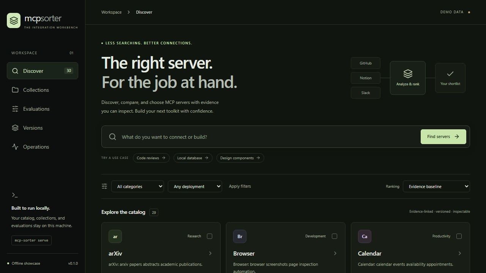
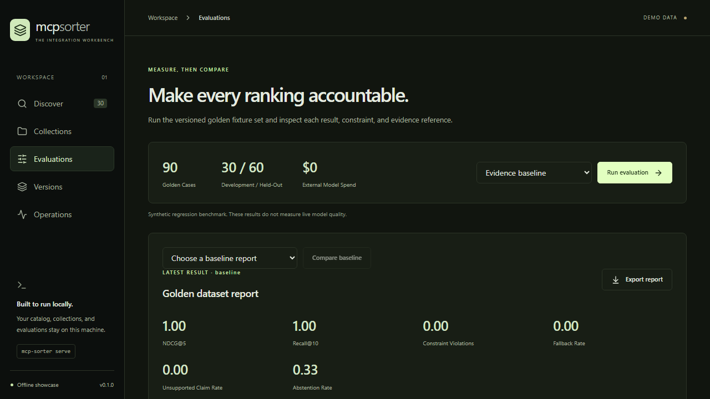
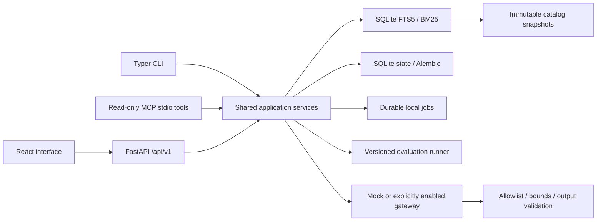

# MCP Server Sorter

Find, compare, and keep MCP server selections with evidence you can inspect.

A local integration workbench with deterministic search, optional validated reranking, versioned catalogs, reproducible evaluations, and recovery tools. The default showcase runs entirely offline after installation: 30 synthetic server records, repeatable mock providers, no credentials, and no paid calls.



## Run the showcase

Build prerequisites: **Python 3.13**, **Node.js 24**, and **uv**. Dependency installation requires internet access; the running demo does not. Native operation requires no Docker.

```sh
git clone https://github.com/heygabedev/mcp-server-sorter.git
cd mcp-server-sorter
uv sync --frozen --python 3.13
npm ci --prefix web
uv run python scripts/build_release.py
uv tool run --python 3.13 --from ./dist/mcp_server_sorter-0.1.0-py3-none-any.whl mcp-sorter serve
```

Open **http://127.0.0.1:8000**. The wheel contains the interface; Node is needed only to build it. Data stays in `.data` beneath the directory where the service starts. Set `SORTER_DATA_DIR` to use a different location.

An already-built wheel can be launched with the last command alone. The [release assets](https://github.com/heygabedev/mcp-server-sorter/releases) include artifact checksums. Fully offline installations use a previously downloaded wheelhouse; see [recovery and artifact management](docs/recovery.md).

Alternatively, download the Linux amd64 container archive from the same release, verify its checksum, and load it locally:

```sh
docker load --input mcp-server-sorter-0.1.0-linux-amd64.tar.gz
docker compose -p mcp-sorter up -d
```

Run Compose from this repository. It binds to `127.0.0.1:8000`, stores data in a named volume, and uses a read-only container filesystem. The archive needs no registry credentials. Only Linux amd64 images are verified; native wheel checks cover Windows and Linux. See [container recovery](docs/recovery.md#container-image-rollback) for backup and pinned-image rollback.

## Walk through the demo

1. **Discover:** search for `github pull requests` or `local database`, apply filters, and open a record to inspect its evidence. Deprecated records are excluded by default; unknown metadata stays unknown.
2. **Compare:** select up to four records. Compare transport, authentication, and license, then save a named collection. Export and import selections with their pinned versions and evidence.
3. **Evaluate:** run the evidence baseline, compare it with a saved run, then try the mock fast or malformed-output profiles. Inspect each case, constraint failure, unsupported explanation, and fallback reason.
4. **Operate:** submit a catalog refresh, inspect durable jobs and request traces, and see local alert conditions.
5. **Recover:** compare catalog versions, activate an earlier catalog/configuration pair, and create a verified backup. Restoration uses a new data directory and preserves collections added after the backup.

The server names are familiar integration examples. Their capabilities, licenses, versions, and evidence are **illustrative fixtures**, not verified claims about vendor products. Model presets simulate success, timeouts, rate limits, malformed output, and unavailable providers. The displayed timings measure this local implementation, not provider latency.



## Architecture



Python 3.13, FastAPI, Pydantic, SQLAlchemy/Alembic, SQLite FTS5, HTTPX, and Typer serve the same application logic through REST, CLI, and MCP. React/TypeScript/Vite builds into the Python wheel.

Each catalog snapshot has its own immutable SQLite index. Historical snapshots cannot change the active snapshot's BM25 corpus statistics. Filters run before result limits; evidence count, timestamp capped to the snapshot date, and server ID resolve ranking ties. Optional reranking is restricted to the first 20 known candidates and their evidence IDs. Invalid output falls back to deterministic retrieval.

Jobs persist their inputs, configuration and catalog pins, idempotency keys, attempts, and renewable leases. Owner fencing prevents an expired worker from committing a result after another worker takes over. The local SQLite state store uses short transactions, a busy timeout, and rollback journaling. This is a single-machine demo, not a distributed task queue.

Version boundaries are independent:

| Artifact | Identity and compatibility |
| --- | --- |
| Application | Package version, pinned wheel SHA-256, container image ID |
| State schema | Alembic revision plus an application compatibility manifest |
| Catalog | Canonical-content SHA-256 and independent FTS index |
| Ranking configuration | Immutable configuration SHA-256, policy version and weights |
| Prompts and model profiles | Explicit versions and prompt/schema hashes when reranking runs |
| Evaluation dataset | Dataset version, content hash, intent split and review status |
| Evaluation run | Immutable report ID, source hash and all relevant artifact pins |

Catalog/configuration activation changes both pointers in one transaction. [Recovery instructions](docs/recovery.md) cover data restoration and application rollback.

## Evaluation results

The bundled golden mock dataset contains **90 scenarios: 30 development and 60 held-out**, separated by intent, plus six adversarial query fixtures. Judgments include relevance grades, supporting evidence, expected abstention, rationale, and `fixture-authored` review status.

| Fixture profile | NDCG@5 | Recall@10 | Reciprocal rank | Fallback rate |
| --- | ---: | ---: | ---: | ---: |
| Evidence baseline | 1.000 | 1.000 | 1.000 | 0% |
| Mock balanced | 1.000 | 1.000 | 1.000 | 0% |
| Mock fast | 0.969 | 1.000 | 0.958 | 0% |
| Mock timeout / malformed / rate-limited / unavailable | 1.000 | 1.000 | 1.000 | 66.7% |

These are synthetic regression results, **not live model quality measurements**. Thirty cases require abstention and never call a reranker. The mock fast profile deliberately swaps candidates; its NDCG decrease of 0.0308 fails the 0.02 regression threshold. Failure presets keep the baseline results through fallback. All profiles produce zero constraint violations, invalid evidence references, and unsupported generated explanation templates.

Reports contain JSON and escaped HTML, per-case failures, latency, abstention, schema failures, fallback rate, available usage metadata, and paired comparisons with a deterministic bootstrap over intents. The explanation check verifies generated templates against pinned catalog facts; it does not independently verify vendor claims. See [raw results and test evidence](docs/verification.md).

```sh
uv run mcp-sorter eval run
uv run mcp-sorter eval run --profile demo-malformed
uv run mcp-sorter eval compare BASELINE_ID CANDIDATE_ID
uv run python scripts/record_fixture_results.py
```

## Tests and performance

The v0.1.1 regression gate requires correct abstention on every case and checks NDCG changes separately for development and held-out cases, as well as overall. Comparison output identifies the failed scope and rule; simulated provider failures remain visible without failing a correct fallback ranking.

Evaluation JSON is immutable. If a worker exits after saving JSON, its next attempt regenerates the HTML export from that saved result without rerunning the evaluation.

Unit, property/metamorphic, SQLite integration, API schema, external contract, security, reliability, UI, accessibility, packaging, and recovery checks are implemented. Network access is denied in ordinary Python tests except loopback and local sockets. No external credentials are needed.

```sh
uv run ruff check .
uv run ruff format --check .
uv run mypy
uv run pytest --cov=mcp_sorter --cov-report=json
uv run python scripts/check_coverage.py
uv run python scripts/export_openapi.py --check
npm --prefix web run lint
npm --prefix web run format:check
npm --prefix web run build
npm --prefix web test
```

For browser tests, run `npx playwright install chromium` from `web`, then `npm run test:e2e`. Playwright starts the local API and web dev server. The journeys include axe checks, keyboard focus, mobile layout, comparisons, collections, evaluations, mock failures, version activation, and backups.

Run `uv run python scripts/mutation_check.py` and `uv run python scripts/benchmark.py` for the bounded mutation and load suites. The Linux reference run used 10,000 synthetic records: **74.9 ms p95 at 10 RPS**, **97.9 ms at 50 RPS**, and **70.0 ms during a three-minute 10 RPS soak**, with zero errors across 2,600 requests. This is a short synthetic workload; it does not establish long-term or production capacity.

Local verification reached **94.74% overall branch coverage**, with at least 95% in ranking, evaluation, and recovery. All 13 targeted mutations were detected. Full scope, machine details, raw reports, and platform limits are in [verification](docs/verification.md).

GitHub Actions workflows remain in the repository but are currently disabled at the owner's request. Local checks are the recorded release evidence; historical failed hosted runs are not represented as passes.

## Operations and integrations

`/health/live`, `/health/ready`, `/metrics`, and the Operations screen expose health, job state, controlled fallback events, and local telemetry. Structured logs contain request IDs, trace IDs, and statuses, without query strings, credentials, or raw provider content. OpenTelemetry traces retain the latest 100 spans in memory; SQLite retains 1,000 controlled events. Prometheus configuration, alert rules, and a Grafana dashboard are in `monitoring/`. External monitoring deployment is optional and has not been live-verified.

The default listener binds to loopback. There is no multi-user authentication or authorization layer; the application is intended for a trusted local machine. Keep the listener local.

The MCP server exposes only `search_servers` and `compare_servers` over stdio:

```sh
uv run mcp-sorter mcp
```

Registry, GitHub metadata, OpenRouter, LiteLLM Proxy, and approved remote-probe adapters are contract-tested with controlled responses. Credentials alone never enable networking. [Integration setup](docs/integrations.md) describes the explicit opt-in controls and live-verification limits. [.env.example](.env.example) contains placeholders and is not loaded automatically.

MIT license. See [LICENSE](LICENSE).
