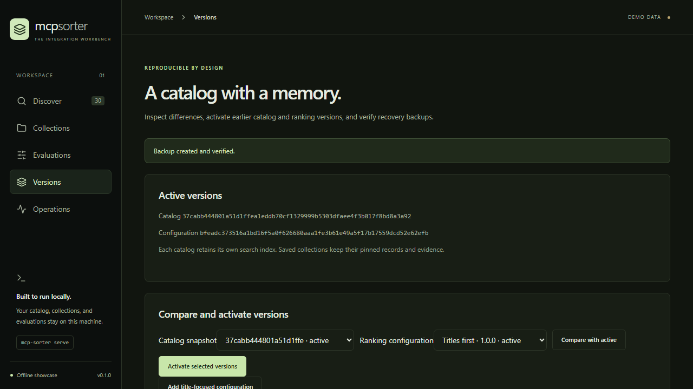

# Versions, backups, and recovery

Use the same `SORTER_DATA_DIR` for the service and management commands. Examples below use `mcp-sorter` from an installed wheel; development commands can be prefixed with `uv run`.

## Catalog and ranking configuration rollback

```sh
mcp-sorter versions
mcp-sorter config create "Titles first" --name-weight 8
mcp-sorter activate CATALOG_SHA256 CONFIGURATION_SHA256
```

Copy the full IDs returned by the commands. Activation validates the immutable artifacts and updates both active pointers atomically. Previous files and activation history remain available, and saved collections are unchanged. The Versions screen provides the same operation and a catalog diff.

## Data backup and restore

```sh
mcp-sorter backup create
mcp-sorter backup verify PATH_TO_BACKUP
```

The first command prints a backup directory. It uses SQLite's backup API, copies retained immutable catalog/configuration/report artifacts, and verifies a checksummed manifest. A backup can be created while the service is running. Copy a completed backup elsewhere for protection against disk loss; checksums detect corruption but do not encrypt or authenticate the bundle.

Stop the service before restoration. Choose a **new directory outside the current data directory**:

```sh
mcp-sorter backup restore PATH_TO_BACKUP ../sorter-restored
```

Restoration first creates a separate pre-restore backup of the current data. It validates checksums, paths, required artifacts, and schema compatibility, then stages the restored database and applies supported forward migrations. Collections added or changed since the selected backup are preserved from the current database. Interrupted jobs return to the queue. Only a validated result is published to the new directory; the old data directory is retained.

Start the service with the returned path:

```sh
export SORTER_DATA_DIR=/absolute/path/to/sorter-restored
mcp-sorter serve
```

PowerShell equivalent: `$env:SORTER_DATA_DIR = 'C:\absolute\path\sorter-restored'`.



## Application wheel rollback

Keep trusted wheel artifacts, their expected SHA-256 checksums, and a platform-specific wheelhouse containing their dependencies. Download dependencies while online:

```sh
uv export --no-dev --no-emit-project --no-hashes --format requirements-txt --output-file dist/requirements.txt
uv run --with pip python -m pip download --only-binary=:all: --dest dist/wheelhouse -r dist/requirements.txt
```

Staging uses an isolated Python environment and installs only binary wheels from that local directory, with the package index disabled:

```sh
mcp-sorter release stage PATH_TO_WHEEL EXPECTED_SHA256 dist/wheelhouse
```

With the service stopped, activate the staged digest and launch it:

```sh
mcp-sorter release activate EXPECTED_SHA256
mcp-sorter release serve
```

Activation verifies the pinned artifact and target release's readable schema revisions, creates a pre-switch data backup when state exists, then atomically changes the release pointer. An unsafe schema rollback is rejected. Activate a second compatible artifact to establish a previous release. After stopping the service, roll back with:

```sh
mcp-sorter release rollback
mcp-sorter release serve
```

This changes the application artifact, not the data history. Use the separate data-restore procedure when an older data snapshot is also needed. Do not downgrade a database manually or install an untrusted wheel merely because its checksum matches an untrusted manifest.

The automated drill builds `0.1.0rc1` and `0.1.0` from the same current source to exercise installation, version selection, HTTP serving, and rollback mechanics. It is not evidence of compatibility with a previously deployed historical release.

## Container image rollback

The release includes a compressed Linux amd64 image archive and its checksum. `docker load --input ARCHIVE.tar.gz` restores its versioned local tag. Keep the previous archive and record its immutable image ID before upgrading:

```sh
docker image inspect mcp-server-sorter:0.1.0 --format '{{.Id}}'
docker compose -p mcp-sorter exec sorter mcp-sorter backup create
docker compose -p mcp-sorter stop
```

The backup command prints a directory beneath `/data/backups`. With the service stopped, check that the target image can read that backup's schema and artifacts. This example uses the volume name created by `docker compose -p mcp-sorter`:

```sh
docker run --rm --network none --mount type=volume,src=mcp-sorter_sorter-data,dst=/data,readonly --entrypoint mcp-sorter PREVIOUS_IMAGE_ID backup verify /data/backups/BACKUP_ID
```

Proceed only if verification succeeds. Choose the exact recorded ID rather than a movable tag, then recreate the service:

```sh
export SORTER_IMAGE=PREVIOUS_IMAGE_ID
docker compose -p mcp-sorter up -d
```

PowerShell equivalent: `$env:SORTER_IMAGE = 'sha256:FULL_IMAGE_ID'`. The existing volume retains collections, catalogs, and configuration. An application rollback does not undo data changes. Do not use `docker compose down --volumes` during recovery.

To reproduce the container drill, build both artifacts and run:

```sh
docker build --build-arg APP_VERSION=0.1.0rc1 -t mcp-server-sorter:0.1.0rc1 .
docker build -t mcp-server-sorter:0.1.0 .
uv run python scripts/container_drill.py
```

The drill creates and removes its own temporary volume. It checks the bundled interface, HTTP search, collection preservation, backup compatibility, query redaction, and an `rc1 → final → rc1` sequence using pinned image IDs. These artifacts share the same application source, so the same historical-compatibility limitation as the wheel drill applies.
